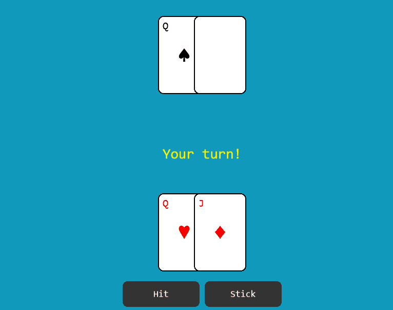

# Blackjack - Pixi.js + TypeScript Game

A simple Blackjack card game built with [PixiJS v8](https://pixijs.com/) and TypeScript.

---

## Live Demo

[Play it on GitHub Pages](https://harrybridgen.github.io/Blackjack-Pixi/)



---

## Features

- Classic Blackjack gameplay
- Hit / Stick / Play Again controls
- Dynamic card drawing and layout
- Face-down card reveal
- Bust and winner detection
- Real-time FPS & timing overlay
- Responsive UI layout

---

## Tech Stack

- **Pixi.js v8** - GPU-accelerated 2D rendering
- **TypeScript** - Modular and strongly typed
- **Vite** - Fast development and bundling
- **GitHub Pages** - Static hosting and deployment

---

## Setup & Run

```bash
# Install dependencies
npm install

# Start dev server
npm run dev

# Build for production
npm run build

# Deploy to GitHub Pages
npm run deploy
```
